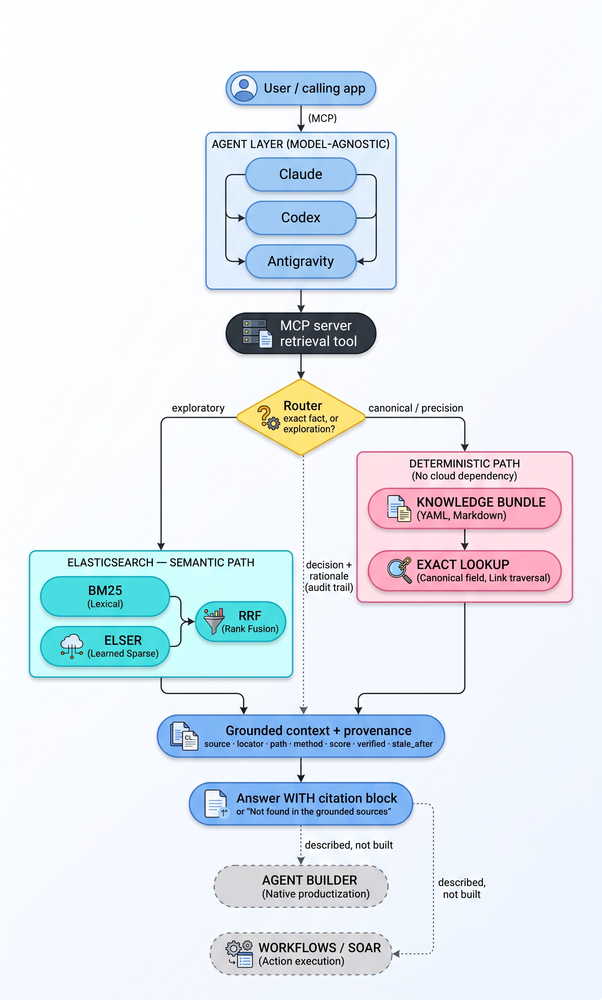

# Grounded Context Layer for Enterprise Agents

A grounded, composable, **deterministic-where-it-matters** context layer for LLM agents —
built on Elasticsearch, reached over MCP, model-agnostic.

**Write-up:** [A Grounded Context Layer for Agents — and Three Things Hybrid Search Won't Tell
You](https://medium.com/@claude.devarenne/a-grounded-context-layer-for-agents-and-three-things-hybrid-search-wont-tell-you-e71fdc334773)
— the design and the three findings behind it.

> **Thesis:** Elasticsearch isn't just a vector store for agents. It's the authoritative,
> auditable context layer that makes an agent's reasoning explainable and verifiable. A
> deterministic canonical path handles facts that must be exact; a semantic hybrid path
> handles exploration; every answer carries provenance.

> ⚠️ **This is a prototype** — a proof of concept, an architecture backed by sample code.
> Read-only, single user, small curated corpus. Not production software.
> See [what it deliberately isn't](#out-of-scope).

---

## What it is

Ask an agent "what's the exact context window of model X?" and a pure-RAG system answers from
whatever chunk scored highest. Sometimes that's right. Sometimes it's a plausible number from an
adjacent doc, delivered with total confidence and no way to check it.

The failure isn't the model. It's that **one probabilistic retrieval path is being asked to
serve two different kinds of question.** Exact facts (a model string, a context window, an
endpoint parameter) have exactly one correct answer and must never be ranked. Exploratory
questions ("how should I chunk documents?") genuinely benefit from semantic search.

This project separates them, routes between them, and makes every answer show its work:

- **Deterministic path** — exact lookup over a curated `knowledge/` bundle of structured
  Markdown. No network, no ranking, no embedding. The guaranteed spine.
- **Semantic path** — BM25 + ELSER on Elasticsearch, fused with reciprocal rank fusion (RRF),
  for open questions.
- **Router** — sends exact-fact queries to the deterministic path and open questions to
  semantic; on ambiguity it runs both and lets the exact hit win. Its decision and rationale are
  part of the audit trail.
- **Provenance, always** — every answer carries a citation block. If retrieval finds nothing,
  the answer is "Not found in the grounded sources" — never a fallback to model memory.



Why it's built this way — the five design properties, OKF grounding, the governance split, and
the central tradeoff — is in **[docs/design.md](docs/design.md)**. Diagram :
[`docs/architecture.mmd`](docs/architecture.mmd).

---

## Run it

Step by step, from `git clone` to a citation block with every command's real output — including
what must exist before the semantic path works: **[docs/quickstart.md](docs/quickstart.md)**. The
short version follows.

### Deterministic path — no cloud account, no API key

```bash
uv sync --extra dev      # builds .venv from uv.lock on the pinned Python (.python-version)

uv run gctx ask "What is the exact context window of claude-opus-5?"
uv run gctx lookup anthropic.claude-opus-5 method        # traverses model → endpoint
uv run gctx --as-of 2026-10-01 lookup anthropic.claude-opus-5 context_window_tokens   # staleness
uv run gctx entities
uv run gctx telemetry summary   # what the layer recorded about its own decisions

uv run pytest -q         # cluster and MCP tests skip without ES / the `mcp` extra
```

The test suite reports its own totals. For a report rather than a terminal summary, run:

```bash
uv run pytest --junitxml=var/test-results.xml                  # machine-readable, no extra dependency
uv run --extra report pytest --html=var/test-report.html --self-contained-html
```

`var/` is gitignored: a test report describes one run on one machine, so it is a build artifact
rather than a committed fact.

The interpreter version and the exact dependency set are properties of the repo, not of your
shell — the *repeatable* property applied to the build itself.

No uv? The standard path works and is not a second-class citizen. The repo develops and locks
against 3.14, but the floor is **3.11** so an older interpreter can still run the demo — the
deterministic path is checked on 3.11, 3.12, and 3.13:

```bash
python3 -m venv .venv && .venv/bin/pip install -e ".[dev]"
.venv/bin/gctx entities
```

Without installing anything, every command works as
`PYTHONPATH=src python3 -m grounded_context.cli …`.

### Semantic path — needs Elasticsearch + ELSER

The semantic half needs a cloud endpoint and an API key in a gitignored `.env`, plus the `es`
extra. [`.env.example`](.env.example) is the template — `cp .env.example .env` and fill it in:

```bash
uv sync --extra dev --extra es
uv run python scripts/fetch_corpus.py                  # 25 curated pages → corpus/raw/ (gitignored)
uv run --extra es python scripts/index_corpus.py --recreate
uv run --extra es gctx ask "How should I chunk documents for retrieval?"
uv run --extra es gctx eval                            # the 18-question set, with verdicts
uv run --extra es gctx eval --compare rank_constant    # ELSER vs BM25 vs hybrid
uv run --extra es gctx telemetry index                 # project the local log into ES
```

Without those credentials the exploratory branch returns `Not found in the grounded sources.`
rather than failing — an unavailable engine is a refusal, not an error, and never a fallback to
the model's own memory.

**Pointing it at your own cluster.** Four settings, read from the environment or the same `.env`:

| | |
|---|---|
| `ES_URL` · `ES_API_KEY` | the endpoint and its key — required, never logged, never committed |
| `ES_INDEX` | the index every command reads and writes (default `grounded-context-corpus`) |
| `ES_INFERENCE_ID` | the ELSER endpoint the mapping is built against (default `.elser-2-elasticsearch`) |

`.elser-2-elasticsearch` is preconfigured on Elastic Cloud Serverless. A self-managed cluster
names its own — `elser_v2`, or whatever `PUT _inference/sparse_embedding/<id>` created — so the
default is just that, not an assumption.

For a cluster behind a corporate CA, `es_client.client()` forwards any keyword argument to the
Elasticsearch client, so `client(ca_certs="/path/to/ca.crt")` works without changing this code.

### From an agent, over MCP

The retrieval tool is exposed as an MCP server over stdio. The SDK is an **extra**, so the
deterministic path stays a PyYAML-only install:

```bash
uv sync --extra dev --extra mcp
uv run gctx-mcp        # serves on stdio; a client drives it
```

[`.mcp.json`](.mcp.json) wires it up for Claude Code on clone. Three tools:
`lookup_canonical_fact`, `ask_grounded`, `list_entities`. The same `gctx-mcp` command was driven
from Claude **and** from Gemini (via the Antigravity CLI) with no adapter and no code change —
the model-agnostic claim, demonstrated rather than asserted. Full transcript and wiring:
**[docs/AntigravityQandA.md](docs/AntigravityQandA.md)**. A third runtime, OpenAI's Codex CLI, is [#4](https://github.com/cdevarenne/grounded-context/issues/4).

**On FastMCP.** `mcp.server.MCPServer` *is* FastMCP: the class was folded into the official SDK
in 2024 and renamed in SDK 2.0 to distinguish it from the standalone project, which now ships
separately as FastMCP 3.x. So the decorator API above is FastMCP's — what is deliberately not
used is the third-party package. Its distinguishing features (server composition, universal
proxying, OpenAPI generation, client-side sampling) solve problems this repo does not have, and
the one that *would* matter for an enterprise deployment — a remote transport with
authentication — is native to the official SDK from 2.0. Putting a third-party wrapper between
the demo and the standard it demonstrates would weaken the model-agnostic claim, not
strengthen it.

---

## Status

| Component | Status |
|---|---|
| Specs — bundle format, provenance contract, router, eval set | ✅ committed, see [`docs/specs/`](docs/specs/) |
| Reference architecture diagram | ✅ committed |
| Canonical knowledge bundle (`knowledge/`) | ✅ 4 concepts, OKF v0.2, values sourced from live docs |
| Deterministic lookup path + link traversal | ✅ pure Python, no network |
| Provenance rendering + refusal | ✅ trust tier, staleness, traversal path |
| Router | ✅ both branches live, BOTH merges exact + semantic |
| CLI (`gctx lookup` / `ask` / `route` / `entities`) | ✅ |
| Test suite | ✅ runs on 3.11–3.14; cluster and MCP tests skip without their extras |
| Compatibility matrix (generated view over the model files) | ✅ [`docs/compatibility-matrix.md`](docs/compatibility-matrix.md), drift-tested |
| Semantic corpus fetch script (`corpus/`, never committed) | ✅ 25 curated pages, manifest committed |
| Elasticsearch hybrid path (BM25 + ELSER, RRF) | ✅ Serverless 9.6, 320 chunks, ELSER |
| MCP server (3 tools, stdio) | ✅ driven from Claude and from Gemini/Antigravity, unchanged |
| Eval harness (`gctx eval`) | ✅ 18 questions, 17 pass + 1 declared deviation |
| Observability — per-query telemetry + local summary | ✅ 4 of 6 signals emitting, schema v2, readback is cloud-free |
| Observability — ES projection (`gctx telemetry index`) | ✅ data-stream-ready mapping, rebuildable from the log |
| Observability — Kibana dashboard | ✅ 6 panels, exported to [`docs/kibana/`](docs/kibana/) |
| Observability — corpus-state snapshot (2 remaining signals) | ⬜ [#5](https://github.com/cdevarenne/grounded-context/issues/5) |

**What's next.** Work to be done is tracked in [GitHub issues](https://github.com/cdevarenne/grounded-context/issues) —
the roadmap:

- [#3 — a staleness early warning](https://github.com/cdevarenne/grounded-context/issues/3), so a
  governance cliff is visible before a citation block starts printing `STALE`
- [#4 — OpenAI/Codex as a third MCP consumer](https://github.com/cdevarenne/grounded-context/issues/4)

---

## Learn more

- **[docs/quickstart.md](docs/quickstart.md)** — clone to first grounded answer, in order, with
  captured output: the deterministic path with no cloud, then the semantic prerequisites, MCP,
  and the telemetry readback.
- **[docs/design.md](docs/design.md)** — the five design properties, OKF grounding, the
  two-corpora governance split, the core tradeoff, and the observability plan.
- **[docs/findings.md](docs/findings.md)** — three things that surfaced while building the
  hybrid path, including a hypothesis the cluster contradicted and what replaced it.
- **[docs/eval-output.md](docs/eval-output.md)** — the captured runs behind every number in the
  findings, so the claims are checkable without my cluster.
- **[grounded-context-jvm](https://github.com/cdevarenne/grounded-context-jvm)** — the same
  architecture in Java and Spring, for teams whose stack is the JVM. **Which to use:** this repo
  is the reference implementation and holds the corpus tooling — the fetch script, the specs, and
  the findings. The JVM repo is the build-ready port: it indexes and serves, and a team points it
  at their own Elasticsearch and their own documents. Everything published here also reproduces
  there, including on an index the JVM side built itself; see
  [`docs/parity.md`](https://github.com/cdevarenne/grounded-context-jvm/blob/main/docs/parity.md).
- **[docs/specs/](docs/specs/)** — the contracts implementation follows:
  [`okf-bundle.md`](docs/specs/okf-bundle.md),
  [`provenance.md`](docs/specs/provenance.md),
  [`router.md`](docs/specs/router.md),
  [`eval.md`](docs/specs/eval.md).
- **[docs/index-spec.md](docs/index-spec.md)** — the chunking rule and index mapping both
  implementations build to, so an index is the same whoever builds it.
- **[docs/compatibility-matrix.md](docs/compatibility-matrix.md)** — generated view over the
  model files.
- **[docs/kibana-setup.md](docs/kibana-setup.md)** — how the telemetry dashboard was built,
  where Kibana's UI fights you, and the two places it deliberately disagrees with the CLI.
- **[docs/maintenance.md](docs/maintenance.md)** — how the canonical layer is kept current:
  re-verifying a concept, moving `stale_after`, refreshing the corpus, and what a build already
  checks for you.
- **[docs/AntigravityQandA.md](docs/AntigravityQandA.md)** — the model-agnostic MCP proof.


---

## Out of scope

- **Read-only.** It answers questions. It does not do things. Nothing you ask it will edit a
  document, change a record, send a message, or call another system on your behalf — there is no
  "file the ticket" or "restart the service" here. You get an answer with a citation, or you get
  a refusal, and that is the whole of it.

  It does write in two places, both about itself rather than about your systems. Every answered
  query appends one line to a local telemetry log (`var/telemetry.ndjson`), and the index-building
  commands — `scripts/index_corpus.py`, `gctx telemetry index` — write to Elasticsearch when you
  run them by hand. Neither can change an answer: the telemetry event is built *after* the answer
  is final, and indexing is a separate step you invoke yourself.
- **No auth, no multi-tenancy, no scale story.** Single user, single index. The MCP server runs
  over stdio as a local subprocess with no authentication or authorization layer — fine for a
  read-only local prototype; a remote transport would need both.
- **Curated corpus, not a crawl.** Two rules that hold regardless of build state: whole sites are
  never scraped, and third-party document text is never committed to this repo.
- **Small-n evaluation.** The eval set is illustrative — which engine answers, and that
  provenance is present. It is **not** a benchmark and no performance claims are made from it.
- **The canonical source is the filesystem.** Lookup reads a bundle parsed from Markdown, with
  nothing between them. Pointing the deterministic path at a system of record — a compliance
  database, a CMDB, a ServiceNow API — is the obvious next step and is not built: it needs a
  provider interface with the Markdown parser as one implementation, and a seam with a single
  implementation proves nothing until there is a second.
- **Agent Builder and Workflows/SOAR are described, not built.**
  [SOAR](https://www.elastic.co/what-is/soar) is the action half of the pattern: the agent
  reasons over grounded context, Workflows executes. This demo is the hand-rolled version of what
  Agent Builder does natively.

## License

MIT — see [LICENSE](LICENSE).
