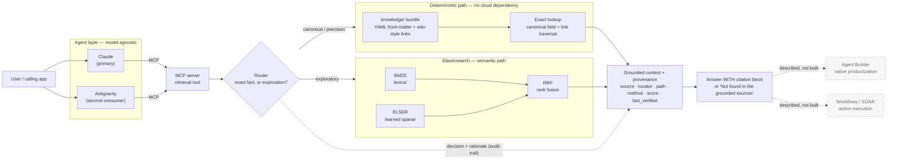

# Grounded Context Layer for Enterprise Agents

A grounded, composable, **deterministic-where-it-matters** context layer for LLM agents —
built on Elasticsearch, reached over MCP, model-agnostic.

> **Thesis:** Elasticsearch isn't just a vector store for agents. It's the authoritative,
> auditable context layer that makes an agent's reasoning explainable and verifiable. A
> deterministic canonical path handles facts that must be exact; a semantic hybrid path
> handles exploration; every answer carries provenance.

---

## The problem

Ask an agent "what's the exact context window of model X?" and a pure-RAG system will answer
from whatever chunk scored highest. Sometimes that's right. Sometimes it's a plausible number
from an adjacent doc, delivered with total confidence and no way to check it.

Enterprises can't ship that. The failure isn't the model — it's that **one probabilistic
retrieval path is being asked to serve two different kinds of question.** Exact facts (a model
string, a context window, an endpoint parameter, a rate limit) have exactly one correct answer
and must never be ranked. Exploratory questions ("how should I chunk documents?") genuinely
benefit from semantic search.

This project separates them, routes between them, and makes every answer show its work.

## Design north star — five properties

Every decision in this repo serves these, in preference to cleverness or scope:

| Property | How it shows up here |
|---|---|
| **Useful** | Answers real questions about real API docs, not a toy corpus |
| **Secure** | Read-only; no credentials in the retrieval path; provenance on every claim |
| **Repeatable** | Same query, same route, same citations — the deterministic path is pure functions over Markdown |
| **Composable** | One MCP tool, consumed unchanged by more than one agent runtime |
| **Deterministic where it matters** | Exact facts never touch a ranking function |

## Architecture



Source: [`docs/architecture.mmd`](docs/architecture.mmd)

### The two paths

**Deterministic path.** A curated `knowledge/` bundle of structured Markdown — YAML
front-matter carrying a `canonical:` block of fields that must never be guessed, plus
wiki-style links for multi-hop traversal. Lookup is an exact match on a field, returning the
value with its `source_url` and `last_verified` date. Pure Python over Markdown, no network,
no ranking, no embedding. **Markdown is the source of truth; any index is a rebuildable
projection of it — never the reverse.**

**Semantic path.** The same questions that don't have one exact answer go to Elasticsearch:
BM25 for lexical precision and ELSER for learned-sparse semantics, combined with reciprocal
rank fusion. Returns document, score, and snippet.

**Router.** Rule-based to start, with an interface that lets an LLM classifier drop in later
without changing callers. Queries naming an entity and asking for a field go deterministic;
open-ended questions go semantic; **on ambiguity it queries both and lets the exact hit win.**
The router's decision and its rationale are part of the audit trail, not just an internal
detail.

## Provenance is mandatory

No answer is emitted without at least one citation. If retrieval returns nothing, the answer
is **"Not found in the grounded sources"** — never a fallback to model memory.

Both paths emit the *same* citation structure, which is what makes a dual engine read as one
auditable system:

```
Answer: <answer text>

  ↳ source: <entity id> · <canonical field>
    path: deterministic (exact-lookup) · verified <ISO date>
    <source url>
```

```
  ↳ source: <document id> · section: <heading>
    path: semantic (hybrid bm25+elser, rrf) · score <float>
    <source url>
```

Format is illustrative — real values come from the date-stamped canonical files and the live
index. The canonical layer is **governed**: a field whose `last_verified` date has aged past a
threshold surfaces a staleness warning, because a stale "authoritative" layer undercuts the
whole point.

## Status

Built in public, first person. Honest state of things:

| Component | Status |
|---|---|
| Specs — bundle format, provenance contract, router, eval set | ✅ committed, see [`docs/specs/`](docs/specs/) |
| Reference architecture diagram | ✅ committed |
| Canonical knowledge bundle + compatibility matrix | 🚧 in progress |
| Deterministic lookup path | 🚧 in progress |
| Provenance rendering | 🚧 in progress |
| MCP server | 🚧 in progress |
| Elasticsearch hybrid path (BM25 + ELSER, RRF) | ⬜ planned |
| Router | ⬜ planned |
| Eval harness | ⬜ planned |

Specs are read on demand and are the contract that implementation follows:

- [`okf-bundle.md`](docs/specs/okf-bundle.md) — canonical bundle format and lookup contract
- [`provenance.md`](docs/specs/provenance.md) — the exact citation-block shape
- [`router.md`](docs/specs/router.md) — classification rules and interface
- [`eval.md`](docs/specs/eval.md) — the ~12-question eval set and expected path per question

## Deliberately out of scope

Naming what this *isn't* is part of the design, not an apology for it:

- **Read-only.** No writes, no actions, no tool execution.
- **No auth, no multi-tenancy, no scale story.** Single user, single index.
- **Curated corpus, not a crawl.** A hand-picked subset of public Elastic / Anthropic / OpenAI
  developer docs — roughly 30–60 pages, fetched by script. Whole sites are not scraped and
  copyrighted document text is not committed to this repo.
- **Small-n evaluation.** The eval set is illustrative, showing which engine answers and that
  provenance is present. It is **not** a benchmark and no performance claims are made from it.
- **Agent Builder and Workflows/SOAR are described, not built.** This demo is the hand-rolled
  version of what Agent Builder does natively; the writeup explains the mapping.

## License

MIT — see [LICENSE](LICENSE).
