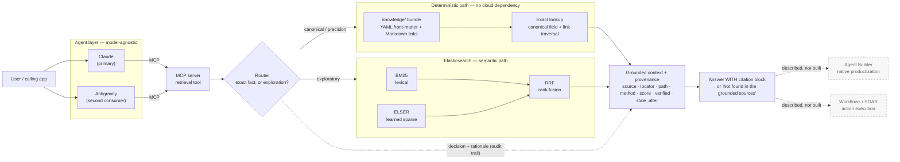

# Grounded Context Layer for Enterprise Agents

A grounded, composable, **deterministic-where-it-matters** context layer for LLM agents —
built on Elasticsearch, reached over MCP, model-agnostic.

> **Thesis:** Elasticsearch isn't just a vector store for agents. It's the authoritative,
> auditable context layer that makes an agent's reasoning explainable and verifiable. A
> deterministic canonical path handles facts that must be exact; a semantic hybrid path
> handles exploration; every answer carries provenance.

---

## The problem

Ask an agent "what's the exact context window of model X?" and a pure-RAG system will answer
from whatever chunk scored highest. Sometimes that's right. Sometimes it's a plausible number
from an adjacent doc, delivered with total confidence and no way to check it.

Enterprises can't ship that. The failure isn't the model — it's that **one probabilistic
retrieval path is being asked to serve two different kinds of question.** Exact facts (a model
string, a context window, an endpoint parameter, a rate limit) have exactly one correct answer
and must never be ranked. Exploratory questions ("how should I chunk documents?") genuinely
benefit from semantic search.

This project separates them, routes between them, and makes every answer show its work.

## Design north star — five properties

Every decision in this repo serves these, in preference to cleverness or scope:

| Property | How it shows up here |
|---|---|
| **Useful** | Answers real questions about real API docs, not a toy corpus |
| **Secure** | Read-only; no credentials in the retrieval path; provenance on every claim |
| **Repeatable** | Same query, same route, same citations — the deterministic path is pure functions over Markdown |
| **Composable** | One MCP tool, consumed unchanged by two agent runtimes — Claude and Gemini |
| **Deterministic where it matters** | Exact facts never touch a ranking function |

## Architecture



Source: [`docs/architecture.mmd`](docs/architecture.mmd)

### The two paths

**Deterministic path.** A curated `knowledge/` bundle of structured Markdown — YAML
front-matter carrying a `canonical:` block of fields that must never be guessed, plus
ordinary Markdown links for multi-hop traversal. Lookup is an exact match on a field, returning the
value with its OKF provenance — `sources`, trust tier, `stale_after`. Pure Python over Markdown, no network,
no ranking, no embedding. **Markdown is the source of truth; any index is a rebuildable
projection of it — never the reverse.**

**Semantic path.** The same questions that don't have one exact answer go to Elasticsearch:
BM25 for lexical precision and ELSER for learned-sparse semantics, combined with reciprocal
rank fusion. Returns document, score, and snippet.

**Router.** Rule-based to start, with an interface that lets an LLM classifier drop in later
without changing callers. Queries naming an entity and asking for a field go deterministic;
open-ended questions go semantic; **on ambiguity it queries both and lets the exact hit win.**
The router's decision and its rationale are part of the audit trail, not just an internal
detail.

## Built on OKF

The canonical layer conforms to
**[OKF, the Open Knowledge Format](https://github.com/GoogleCloudPlatform/knowledge-catalog/tree/main/okf)**
(v0.2, published by Google Cloud) — *"a universal, vendor-neutral format for representing
knowledge as plain markdown files with YAML frontmatter."* A *knowledge bundle* is a directory
of those files.

Vendor-neutrality is the point, and it's why OKF belongs **alongside** an Elasticsearch
architecture rather than competing with one. The canonical layer stays portable and
inspectable; Elasticsearch's job is to be the best index, projection, and observability surface
over it — not to own the format. Markdown remains the source of truth and the index is
rebuildable from it.

**Provenance and freshness come from the format, not from this repo.** OKF v0.2 makes *"trust,
provenance, and freshness… first-class"* and standardizes precisely what a grounded layer needs:

| OKF field | What it carries |
|---|---|
| `sources` | Where a fact came from, with per-source credibility signals |
| `generated` | How the content was produced — actor and timestamp |
| `verified` | Verification events, from which a **trust tier** is derived: unverified · machine-confirmed · human-reviewed |
| `status` | `draft` · `stable` · `deprecated` |
| `stale_after` | Absolute date — a concept is stale when `today >= stale_after` |

Those flow straight into the citation block, which is why the provenance contract here is
thinner than it would otherwise have to be. An earlier draft of this repo invented its own
`source_url` and `last_verified` fields; aligning to OKF's was a strict improvement, and the
`stale_after` absolute date is a better design than the relative TTL it replaced.

**What this repo adds is the retrieval half, which OKF deliberately leaves open.** The spec is
*"minimally opinionated, freely extensible"* — it defines no canonical field values and no
retrieval contract, since bundles *"can be consumed by anything that reads markdown."* So
[`docs/specs/okf-bundle.md`](docs/specs/okf-bundle.md) supplies:

- a **`canonical:` block** — exact-fact values that must never be inferred (model string, context
  window, endpoint path)
- a deterministic **`lookup(entity, field)` contract** returning the value plus its inherited OKF
  provenance, trust tier, and staleness state
- the **router** that decides when a question deserves that path at all, plus the uniform citation
  contract shared with the semantic path

### Two bodies of content, two different rules

The two retrieval paths read from two different corpora, and the split is deliberate — they carry
different governance obligations, so conflating them would be a licensing problem as much as an
architectural one:

| | `knowledge/` — canonical layer | `corpus/` — semantic layer |
|---|---|---|
| Holds | My own structured facts: exact values with sources and verification dates | Third-party documentation prose |
| Produced by | Hand-curation, one concept per file | A fetch script, from public docs |
| In git? | **Yes** — it *is* the source of truth | **No** — `corpus/raw/` is gitignored; the script is what ships |
| Governed by | Every exact fact carries `sources`, `verified`, `stale_after` | Never scrape whole sites; never commit copyrighted text |
| Size driver | Small because each fact is hand-verified | ~30–60 pages because curation is the scope lever |
| Status | Built — 4 concepts | Planned |

This is why the canonical layer is small and the semantic corpus is fetched rather than vendored:
one is mine to govern, the other isn't mine to redistribute.

## Provenance is mandatory

No answer is emitted without at least one citation. If retrieval returns nothing, the answer
is **"Not found in the grounded sources"** — never a fallback to model memory.

Both paths emit the *same* citation structure, which is what makes a dual engine read as one
auditable system:

```
Answer: <answer text>

  ↳ source: <entity id> · <canonical field>
    path: deterministic (exact-lookup) · verified <ISO date>
    <source url>
```

```
  ↳ source: <document id> · section: <heading>
    path: semantic (hybrid bm25+elser, rrf) · score <float>
    <source url>
```

Format is illustrative — real values come from the date-stamped canonical files and the live
index. The canonical layer is **governed**: OKF's `verified` events yield a trust tier, and once
`today >= stale_after` the citation carries a staleness warning — because a stale
"authoritative" layer undercuts the whole point.

## The tradeoff, and the open question

The deterministic path does not eliminate the data-preparation problem. It **relocates** it —
from chunking strategy and embedding drift to **curation governance.** Someone has to decide
which facts are canonical and keep them fresh. That cost is real, and it's the honest price of
determinism.

It's the right trade for facts where a confident wrong answer is worse than no answer. But it
raises the question this project exists to answer:

> **Does curation scale?** A 30–60 page corpus is hand-curatable by one person. At ten thousand
> documents, is a canonical layer still viable — or does it become the bottleneck that makes the
> whole approach un-shippable in production?

That's an open question here, not a settled one. I'd rather instrument it than have an opinion
about it — which is what the next piece is for.

## Observability — how the open question gets answered

The retrieval layer emits its own telemetry into Elasticsearch, the same platform serving the
semantic path:

| Signal | What it tells you |
|---|---|
| Router decisions + rationale | What fraction of real queries actually need the deterministic path |
| Canonical hit / miss rate | How often a precision query finds no canonical field — the curation backlog, measured |
| Concepts past `stale_after` | Whether governance is keeping up or falling behind |
| Trust-tier distribution | What share of the corpus is human-reviewed vs machine-confirmed vs unverified |
| Refusal rate | How often "not found in the grounded sources" fires |
| Per-path latency | What routing to `BOTH` actually costs |

Those six signals turn "does curation scale?" from an argument into a dashboard, and they make
the context layer *itself* observable. Lessons from that instrumentation are what should decide
whether this approach is production-worthy, and what the alternatives are if it isn't.

## Status

| Component | Status |
|---|---|
| Specs — bundle format, provenance contract, router, eval set | ✅ committed, see [`docs/specs/`](docs/specs/) |
| Reference architecture diagram | ✅ committed |
| Canonical knowledge bundle (`knowledge/`) | ✅ 4 concepts, OKF v0.2, values sourced from live docs |
| Deterministic lookup path + link traversal | ✅ pure Python, no network |
| Provenance rendering + refusal | ✅ trust tier, staleness, traversal path |
| Router | ✅ deterministic side live; semantic branch stubbed |
| CLI (`gctx lookup` / `ask` / `route` / `entities`) | ✅ |
| Test suite | ✅ 74 tests, incl. a packaging smoke test of the installed script |
| Compatibility matrix (generated view over the model files) | ⬜ planned |
| Semantic corpus fetch script (`corpus/`, never committed) | ⬜ planned |
| Elasticsearch hybrid path (BM25 + ELSER, RRF) | ⬜ planned |
| MCP server (3 tools, stdio) | ✅ driven from Claude and from Gemini/Antigravity, unchanged |
| Eval harness | ⬜ planned |
| Observability instrumentation (router / staleness / refusal telemetry) | ⬜ planned |

Run it with no cloud account and no API key:

```bash
uv sync --extra dev      # builds .venv from uv.lock on the pinned Python (.python-version)

uv run gctx ask "What is the exact context window of claude-opus-5?"
uv run gctx lookup anthropic.claude-opus-5 method        # traverses model → endpoint
uv run gctx --as-of 2026-10-01 lookup anthropic.claude-opus-5 context_window_tokens   # staleness
uv run gctx entities

uv run pytest -q         # 74 tests
```

The interpreter version and the exact dependency set are properties of the repo, not of your
shell — that's the *repeatable* property applied to the build itself.

No uv? The standard path works and is not a second-class citizen:

```bash
python3.14 -m venv .venv && .venv/bin/pip install -e ".[dev]"
.venv/bin/gctx entities
```

Without installing at all, every command works as `PYTHONPATH=src python3 -m grounded_context.cli …`.

### Reaching it from an agent, over MCP

The retrieval tool is exposed as an MCP server over stdio. The SDK is an **extra**, so the
deterministic path above stays a PyYAML-only install:

```bash
uv sync --extra dev --extra mcp
uv run gctx-mcp        # serves on stdio; a client drives it
```

[`.mcp.json`](.mcp.json) in the repo root wires it up for Claude Code on clone, with no
per-machine configuration. Three tools: `lookup_canonical_fact`, `ask_grounded`,
`list_entities`.

**Model-agnostic, demonstrated rather than asserted.** The same `gctx-mcp` command was driven
from Claude and from Gemini (via the Antigravity CLI), with no adapter, no code change, and no
per-client branch — only a config entry pointing at the same executable. Gemini picked
`ask_grounded` on its own for a natural-language question and `lookup_canonical_fact` for direct
ones, and reproduced the citation blocks verbatim, staleness warning included. Transcript:
[`AntigravityQandA.md`](docs/AntigravityQandA.md).

Every tool returns the identical envelope the CLI renders, plus a `rendered` citation block to
reproduce. The tool descriptions carry the contract into the model's context: exact facts come
from the tool and never from memory, and `Not found in the grounded sources.` is repeated as-is
rather than filled in.

**That last part is the one worth testing, and it held.** Asked how to chunk documents for
retrieval — with no instruction about how to answer, only a phrase naming which tool set to use
— Gemini returned exactly `Not found in the grounded sources.` It did not fall back on training
data it demonstrably has. The refusal travels in the tool description, not in the prompt, which
is what makes it a property of the retrieval layer rather than of one carefully worded agent.

Specs are read on demand and are the contract that implementation follows:

- [`okf-bundle.md`](docs/specs/okf-bundle.md) — canonical bundle format and lookup contract
- [`provenance.md`](docs/specs/provenance.md) — the exact citation-block shape
- [`router.md`](docs/specs/router.md) — classification rules and interface
- [`eval.md`](docs/specs/eval.md) — the ~12-question eval set and expected path per question

## Out of scope


- **Read-only.** No writes, no actions, no tool execution.
- **No auth, no multi-tenancy, no scale story.** Single user, single index. The MCP server runs
  over stdio as a local subprocess and has no authentication or authorization layer — fine for a
  read-only local tool, this is only a prototype. A remote transport would need both.
- **Curated corpus, not a crawl.** Two rules that hold regardless of build state: whole sites are
  never scraped, and third-party document text is never committed to this repo. The semantic
  path's corpus *will be* a hand-picked subset of public Elastic / Anthropic / OpenAI developer
  docs on the order of 30–60 pages, retrieved by a fetch script — see the status table for where
  that stands, and the two-corpora table above for why it is governed differently from `knowledge/`.
- **Small-n evaluation.** The eval set is illustrative, showing which engine answers and that
  provenance is present. It is **not** a benchmark and no performance claims are made from it.
- **Agent Builder and Workflows/SOAR are described, not built.**
  [SOAR](https://www.elastic.co/what-is/soar) — security orchestration, automation and response —
  is the action half of the pattern: the agent reasons over grounded context, Workflows executes.
  This demo is the hand-rolled version of what Agent Builder does natively; the writeup explains
  the mapping.

## License

MIT — see [LICENSE](LICENSE).
