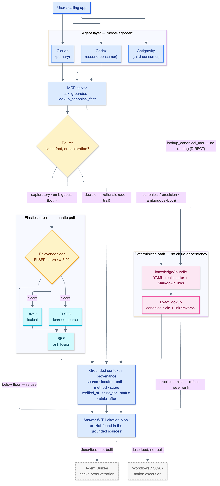

# Grounded Context Layer for Enterprise Agents

A grounded, composable, **deterministic-where-it-matters** context layer for LLM agents —
built on Elasticsearch, reached over MCP, model-agnostic.

> **Thesis:** Elasticsearch isn't just a vector store for agents. It's the authoritative,
> auditable context layer that makes an agent's reasoning explainable and verifiable. A
> deterministic canonical path handles facts that must be exact; a semantic hybrid path
> handles exploration; every answer carries provenance.

> ⚠️ **This is a prototype** — a proof of concept, an architecture backed by sample code.
> Read-only, single user, small curated corpus. Not production software.
> See [what it deliberately isn't](#out-of-scope).

---

## What it is

Ask an agent "what's the exact context window of model X?" and a pure-RAG system answers from
whatever chunk scored highest. Sometimes that's right. Sometimes it's a plausible number from an
adjacent doc, delivered with total confidence and no way to check it.

The failure isn't the model. It's that **one probabilistic retrieval path is being asked to
serve two different kinds of question.** Exact facts (a model string, a context window, an
endpoint parameter) have exactly one correct answer and must never be ranked. Exploratory
questions ("how should I chunk documents?") genuinely benefit from semantic search.

This project separates them, routes between them, and makes every answer show its work:

- **Deterministic path** — exact lookup over a curated `knowledge/` bundle of structured
  Markdown. No network, no ranking, no embedding. The guaranteed spine.
- **Semantic path** — BM25 + ELSER on Elasticsearch, fused with reciprocal rank fusion (RRF),
  for open questions.
- **Router** — sends exact-fact queries to the deterministic path and open questions to
  semantic; on ambiguity it runs both and lets the exact hit win. Its decision and rationale are
  part of the audit trail.
- **Provenance, always** — every answer carries a citation block. If retrieval finds nothing,
  the answer is "Not found in the grounded sources" — never a fallback to model memory.



Why it's built this way — the five design properties, OKF grounding, the governance split, and
the central tradeoff — is in **[docs/design.md](docs/design.md)**. Diagram :
[`docs/architecture.mmd`](docs/architecture.mmd).

---

## Run it

### Deterministic path — no cloud account, no API key

```bash
uv sync --extra dev      # builds .venv from uv.lock on the pinned Python (.python-version)

uv run gctx ask "What is the exact context window of claude-opus-5?"
uv run gctx lookup anthropic.claude-opus-5 method        # traverses model → endpoint
uv run gctx --as-of 2026-10-01 lookup anthropic.claude-opus-5 context_window_tokens   # staleness
uv run gctx entities

uv run pytest -q         # 132 collected here; 94 pass, the rest skip without ES / the mcp extra
```

The interpreter version and the exact dependency set are properties of the repo, not of your
shell — the *repeatable* property applied to the build itself.

No uv? The standard path works and is not a second-class citizen. The repo develops and locks
against 3.14, but the floor is **3.11** so an older interpreter can still run the demo — the
deterministic path is checked on 3.11, 3.12, and 3.13:

```bash
python3 -m venv .venv && .venv/bin/pip install -e ".[dev]"
.venv/bin/gctx entities
```

Without installing at all, every command works as
`PYTHONPATH=src python3 -m grounded_context.cli …`.

### Semantic path — needs Elasticsearch + ELSER

The semantic half needs a cloud endpoint and an API key in a gitignored `.env`, plus the `es`
extra:

```bash
uv sync --extra dev --extra es
uv run python scripts/fetch_corpus.py                  # 25 curated pages → corpus/raw/ (gitignored)
uv run --extra es python scripts/index_corpus.py --recreate
uv run --extra es gctx ask "How should I chunk documents for retrieval?"
uv run --extra es gctx eval                            # the 12-question set, with verdicts
uv run --extra es gctx eval --compare rank_constant    # ELSER vs BM25 vs hybrid
```

Without those credentials the exploratory branch returns `Not found in the grounded sources.`
rather than failing — an unavailable engine is a refusal, not an error, and never a fallback to
the model's own memory.

### From an agent, over MCP

The retrieval tool is exposed as an MCP server over stdio. The SDK is an **extra**, so the
deterministic path stays a PyYAML-only install:

```bash
uv sync --extra dev --extra mcp
uv run gctx-mcp        # serves on stdio; a client drives it
```

[`.mcp.json`](.mcp.json) wires it up for Claude Code on clone. Three tools:
`lookup_canonical_fact`, `ask_grounded`, `list_entities`. The same `gctx-mcp` command was driven
from Claude **and** from Gemini (via the Antigravity CLI) with no adapter and no code change —
the model-agnostic claim, demonstrated rather than asserted. Full transcript and wiring:
**[docs/AntigravityQandA.md](docs/AntigravityQandA.md)**.

---

## Status

| Component | Status |
|---|---|
| Specs — bundle format, provenance contract, router, eval set | ✅ committed, see [`docs/specs/`](docs/specs/) |
| Reference architecture diagram | ✅ committed |
| Canonical knowledge bundle (`knowledge/`) | ✅ 4 concepts, OKF v0.2, values sourced from live docs |
| Deterministic lookup path + link traversal | ✅ pure Python, no network |
| Provenance rendering + refusal | ✅ trust tier, staleness, traversal path |
| Router | ✅ both branches live, BOTH merges exact + semantic |
| CLI (`gctx lookup` / `ask` / `route` / `entities`) | ✅ |
| Test suite | ✅ 143 tests with all extras; runs on 3.11–3.14, count drift-tested |
| Compatibility matrix (generated view over the model files) | ✅ [`docs/compatibility-matrix.md`](docs/compatibility-matrix.md), drift-tested |
| Semantic corpus fetch script (`corpus/`, never committed) | ✅ 25 curated pages, manifest committed |
| Elasticsearch hybrid path (BM25 + ELSER, RRF) | ✅ Serverless 9.6, 320 chunks, ELSER |
| MCP server (3 tools, stdio) | ✅ driven from Claude and from Gemini/Antigravity, unchanged |
| Eval harness (`gctx eval`) | ✅ 12 questions, 11 pass + 1 declared deviation |
| Observability instrumentation (router / staleness / refusal telemetry) | ⬜ planned |

---

## Learn more

- **[docs/design.md](docs/design.md)** — the five design properties, OKF grounding, the
  two-corpora governance split, the core tradeoff, and the observability plan.
- **[docs/findings.md](docs/findings.md)** — three things that broke while building the hybrid
  path, including one claim I got wrong and had to correct against the cluster.
- **[docs/eval-output.md](docs/eval-output.md)** — the captured runs behind every number in the
  findings, so the claims are checkable without my cluster.
- **[docs/specs/](docs/specs/)** — the contracts implementation follows:
  [`okf-bundle.md`](docs/specs/okf-bundle.md),
  [`provenance.md`](docs/specs/provenance.md),
  [`router.md`](docs/specs/router.md),
  [`eval.md`](docs/specs/eval.md).
- **[docs/compatibility-matrix.md](docs/compatibility-matrix.md)** — generated view over the
  model files.
- **[docs/AntigravityQandA.md](docs/AntigravityQandA.md)** — the model-agnostic MCP proof.

<!-- TODO(devarenne): once the ELX-11 blog is live, add a "Write-up" link here and near the top. -->

---

## Out of scope

- **Read-only.** No writes, no actions, no tool execution.
- **No auth, no multi-tenancy, no scale story.** Single user, single index. The MCP server runs
  over stdio as a local subprocess with no authentication or authorization layer — fine for a
  read-only local prototype; a remote transport would need both.
- **Curated corpus, not a crawl.** Two rules that hold regardless of build state: whole sites are
  never scraped, and third-party document text is never committed to this repo.
- **Small-n evaluation.** The eval set is illustrative — which engine answers, and that
  provenance is present. It is **not** a benchmark and no performance claims are made from it.
- **Agent Builder and Workflows/SOAR are described, not built.**
  [SOAR](https://www.elastic.co/what-is/soar) is the action half of the pattern: the agent
  reasons over grounded context, Workflows executes. This demo is the hand-rolled version of what
  Agent Builder does natively.

## License

MIT — see [LICENSE](LICENSE).
