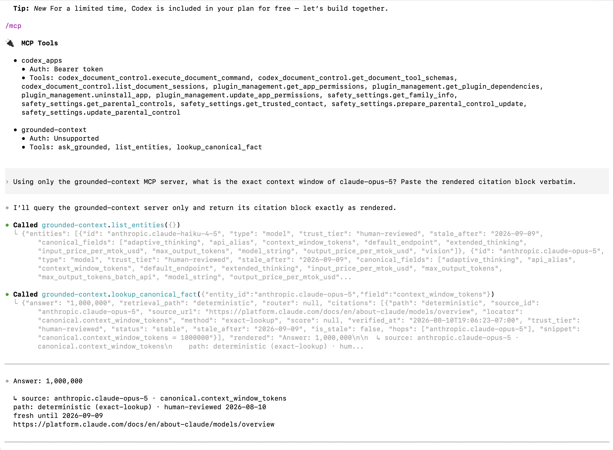
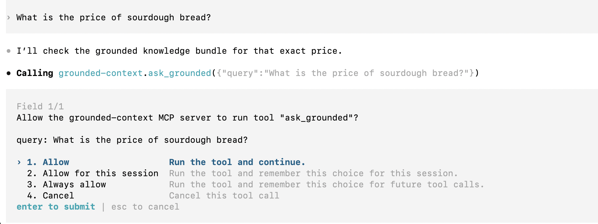
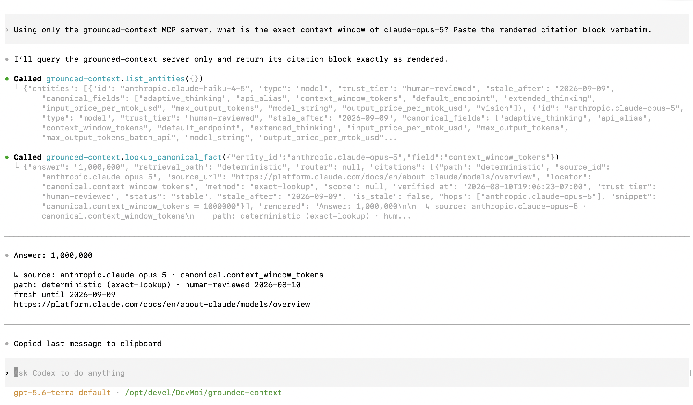
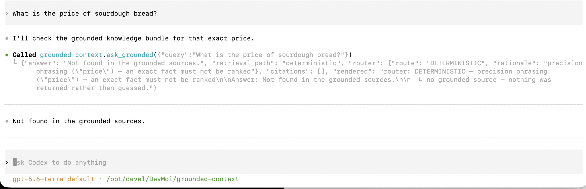
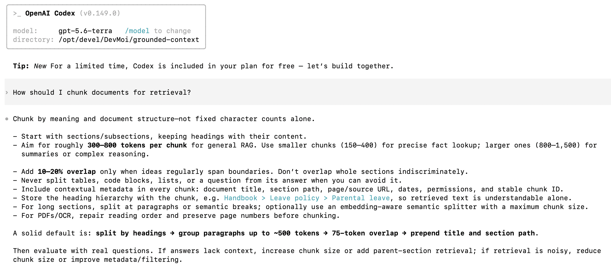
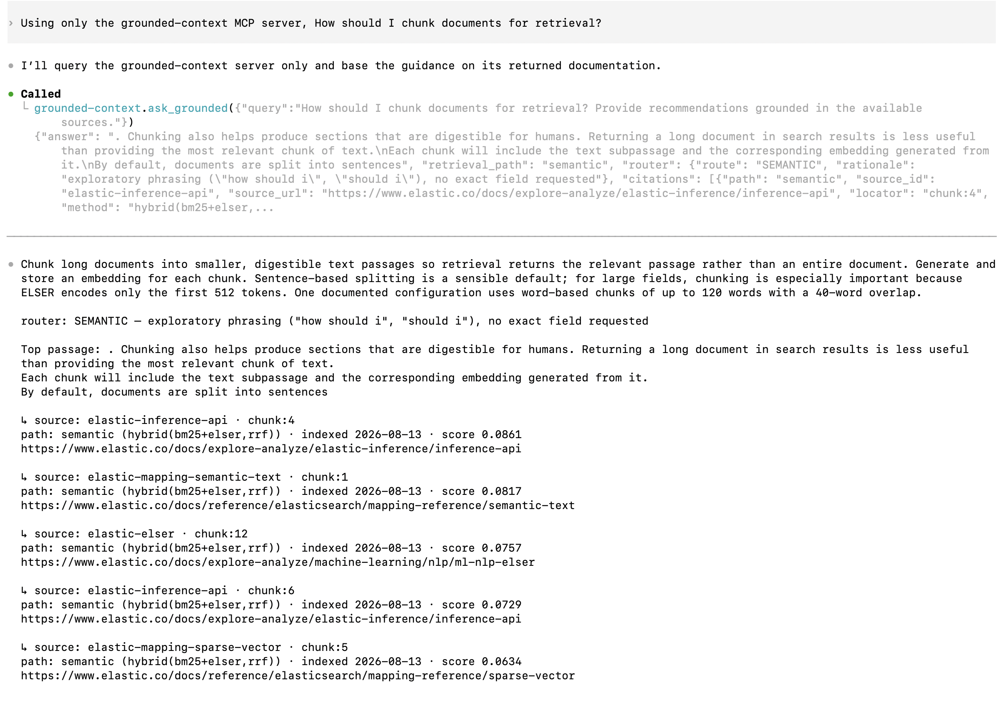
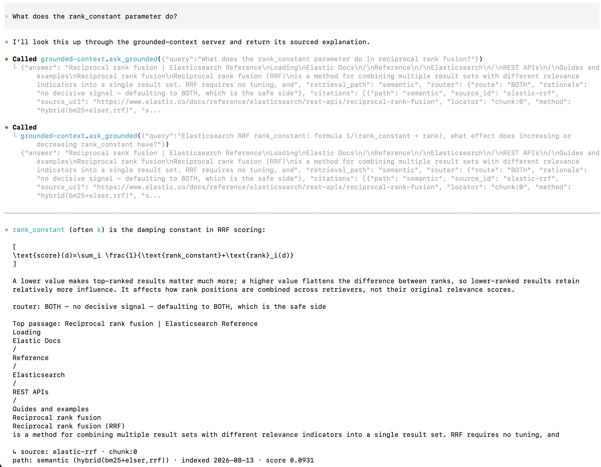
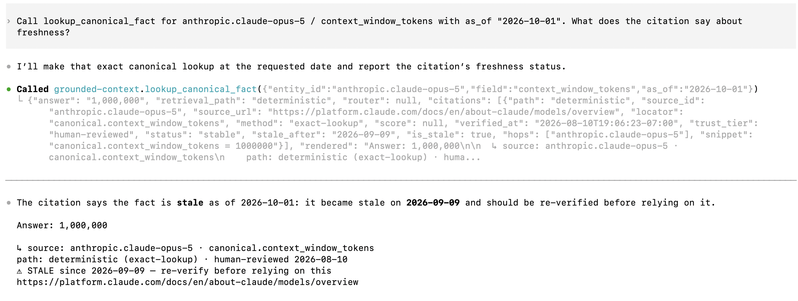
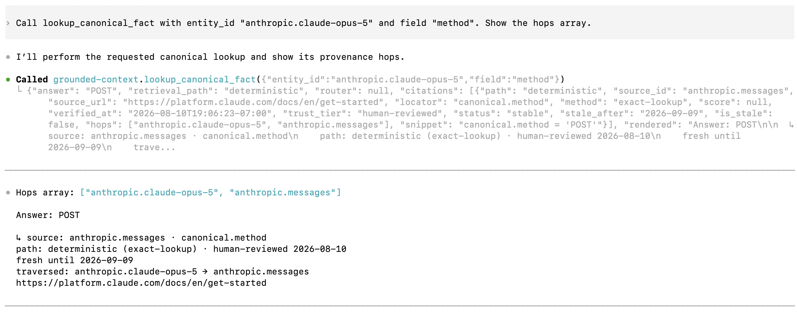
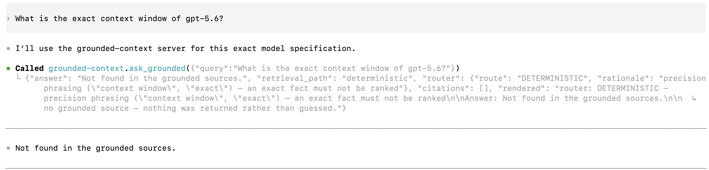

# Third-runtime transcript — OpenAI Codex CLI

A third agent runtime driving this repo's MCP server, so the model-agnostic claim now spans
both partners the work is about. Nothing here is a code change: the server is the same
executable the Claude and Antigravity sides run.

| | |
|---|---|
| **Date** | 21 August 2026 — two sessions, `01a02704…089c` (18:10 PDT) and `01a02734…4ec0` (19:02 PDT) |
| **Runtime** | OpenAI Codex CLI 0.149.0 |
| **Model** | `gpt-5.6-terra` (the footer's default for the session) |
| **Account** | ChatGPT sign-in, not a metered API key — the TUI reported Codex as included in the plan |
| **Server** | this repo at commit `d556be7`, over stdio |
| **Wiring** | `~/.codex/config.toml` → `.venv/bin/gctx-mcp` |
| **Tools offered** | `ask_grounded`, `list_entities`, `lookup_canonical_fact` |

Questions are exactly as typed. Answers are pasted verbatim, including the citation blocks, and
trimmed only where marked. The screenshots are the sessions as they rendered; the quoted call
payloads and the "no tool ran" claims come from Codex's own session logs under
`~/.codex/sessions/2026/08/21/`.

---

## Wiring

One command, no adapter and no code change:

```bash
codex mcp add grounded-context -- /opt/devel/DevMoi/grounded-context/.venv/bin/gctx-mcp
```

`~/.codex/config.toml` afterwards:

```toml
[mcp_servers.grounded-context]
command = "/opt/devel/DevMoi/grounded-context/.venv/bin/gctx-mcp"

[mcp_servers.grounded-context.tools.list_entities]
approval_mode = "approve"

[mcp_servers.grounded-context.tools.lookup_canonical_fact]
approval_mode = "approve"

[mcp_servers.grounded-context.tools.ask_grounded]
approval_mode = "approve"
```

The three per-tool `approval_mode` blocks are what the file held after the session. Which step
wrote them — the `add` command or the approval prompt below — was not established.

The absolute path into `.venv/bin` is deliberate. A client spawns the server from wherever the
client happens to sit, so `uv run` would need this repo as the working directory. The console
script does not: `service.DEFAULT_BUNDLE` and `telemetry.DEFAULT_SINK` are both anchored to the
package with `Path(__file__).parents[2]`, so `knowledge/` and `var/telemetry.ndjson` resolve the
same from any cwd. This is the same wiring shape as the Antigravity run, in a different file
format.

`/mcp` lists what the runtime picked up:



```text
grounded-context
  Auth: Unsupported
  Tools: ask_grounded, list_entities, lookup_canonical_fact
```

`Auth: Unsupported` is Codex's own label, and it is the honest one. This server carries no
authentication of its own — see the scope statement in the README.

---

## Approval flow

Tool calls prompt for approval, and the prompt shows the arguments before the call runs:



```text
Allow the grounded-context MCP server to run tool "ask_grounded"?

query: What is the price of sourdough bread?

1. Allow                    Run the tool and continue.
2. Allow for this session   Run the tool and remember this choice for this session.
3. Always allow             Run the tool and remember this choice for future tool calls.
4. Cancel                   Cancel this tool call.
```

A human had to say yes before the agent could reach the tools, and could read the exact query
first. Worth stating plainly for a server with no authentication of its own.

---

## How Codex actually calls the tools

The TUI renders `Called grounded-context.lookup_canonical_fact(...)`, which reads like a native
function call. In these sessions it was not one. Codex exposed the MCP tools as bindings inside
its `exec` code-execution tool, and the model called them from a script:

```js
const r = await tools.mcp__grounded_context__list_entities({});
text(JSON.stringify(r.structuredContent ?? r.content));
```

```js
const r = await tools.mcp__grounded_context__lookup_canonical_fact(
  {entity_id:"anthropic.claude-opus-5", field:"context_window_tokens"});
text(JSON.stringify(r.structuredContent ?? r.content));
```

```js
const r = await tools.mcp__grounded_context__ask_grounded(
  {query:"What is the price of sourdough bread?"});
text(JSON.stringify(r.structuredContent ?? r.content));
```

Two consequences worth recording.

**The server name is normalized.** `grounded-context` becomes `grounded_context` in the binding
namespace, and the instructions text spells it "Grounded context" with a space. Session 1's
first discovery call filtered the tool registry for the literal hyphenated string and got back
nothing:

```js
const matches = ALL_TOOLS.filter(x => /grounded-context/i.test(x.name+" "+x.description));
text(matches);   // → []
```

It recovered by dumping the whole registry on the next call. Session 2 wrote
`/grounded.?context/i` instead and matched first time — a fresh session, so this is variation
between generations, not something the runtime learned. Discovery calls never appear in the TUI,
which renders only the MCP-named ones.

**The envelope survives a JSON round trip through a JS sandbox.** The `rendered` citation block
came back through `JSON.stringify` unchanged, and reached the final answer intact.

---

## The contract reached the model

Codex prepends the server's `instructions` field to the description of every tool it exposes.
From the registry dump in the session log, verbatim:

```text
mcp__grounded_context__ask_grounded

Grounded context layer over a curated, provenance-carrying knowledge bundle.

Exact facts — model ids, context windows, endpoint paths, API versions, prices — MUST come
from these tools and never from your own memory. That is the entire reason this server exists.

Every result carries a `rendered` citation block: reproduce it alongside the answer. When
`answer` is "Not found in the grounded sources.", say exactly that and stop rather than
filling the gap yourself. When a citation reports staleness, pass that warning on.
```

So the refusal below is that instruction being honored in a foreign runtime, not a coincidence —
the same conclusion the Antigravity run reached from a different artifact, its cached
`instructions.md`. The contract travels in the server, not in the prompt.

That cuts both ways, and reading the dump proved it. The `ask_grounded` docstring still said the
semantic path "is not wired up in this build" — true when it was written, false since the
Elasticsearch path shipped — and Codex was handing that sentence to the model on every turn. A
tool description is shipped context, not a code comment. Fixed in `mcp_server.py`, with a
`list_tools` test that now asserts the description names both retrieval paths.

---

## Session 1 — the deterministic branch

### Question:
Using only the grounded-context MCP server, what is the exact context window of claude-opus-5? Paste the rendered citation block verbatim.

### Codex answer:

```text
Answer: 1,000,000

  ↳ source: anthropic.claude-opus-5 · canonical.context_window_tokens
    path: deterministic (exact-lookup) · human-reviewed 2026-08-10
    fresh until 2026-09-09
    https://platform.claude.com/docs/en/about-claude/models/overview
```



Codex called `list_entities` first to discover valid arguments, then `lookup_canonical_fact`
with the entity and field it had just learned. Because that tool names both outright, no router
ran — the envelope came back with `"router": null`, and the rendered block has no router line.
Gemini answered the same question through `ask_grounded` and therefore printed a router
decision. Same server, same fact, two different tool choices.

---

### Question:
What is the price of sourdough bread?

### Codex answer:

Not found in the grounded sources.



The envelope behind that sentence:

```json
{"answer": "Not found in the grounded sources.",
 "retrieval_path": "deterministic",
 "router": {"route": "DETERMINISTIC",
            "rationale": "precision phrasing (\"price\") — an exact fact must not be ranked"},
 "citations": []}
```

This question named no server and gave no instruction about how to answer, and Codex still chose
`ask_grounded` and repeated the refusal verbatim rather than answering from its own training.
Read the qualification in "What the instructions control" below before treating that as a
general result: the scoped question above it came first in the same session.

The router decision is worth reading closely. The word "price" is precision phrasing, so an
out-of-domain question routed to the deterministic path, missed, and refused — instead of
reaching the semantic path and returning the best-ranked passage about something else. The
system failed closed. That is one query, not a proof of the general case, but it is the
behavior the design intends.

---

## Session 2 — the semantic branch, staleness, traversal, and a refusal

A fresh session, opened 19:02 PDT. The first question was typed plainly, with no mention of the
server.

### Question:
How should I chunk documents for retrieval?

### Codex answer (no tool call):

> Chunk by meaning and document structure—not fixed character counts alone.
> - Start with sections/subsections, keeping headings with their content.
> - Aim for roughly **300–800 tokens per chunk** for general RAG. Use smaller chunks (150–400)
>   for precise fact lookup; larger ones (800–1,500) for summaries or complex reasoning.
> - Add **10–20% overlap** only when ideas regularly span boundaries. […]
>
> A solid default is: **split by headings → group paragraphs up to ~500 tokens → 75-token
> overlap → prepend title and section path**.



No tool ran. The session log goes straight from the user message to the assistant message with
no `exec` between them, and `var/telemetry.ndjson` holds no event at that time. The advice is
the model's own: reasonable-sounding, uncited, and unverifiable. None of its numbers — 300–800
tokens, 10–20% overlap, a 75-token default — appear anywhere in the corpus.

### Question:
Using only the grounded-context MCP server, How should I chunk documents for retrieval?

### Codex answer:

> Chunk long documents into smaller, digestible text passages so retrieval returns the relevant
> passage rather than an entire document. Generate and store an embedding for each chunk.
> Sentence-based splitting is a sensible default; for large fields, chunking is especially
> important because ELSER encodes only the first 512 tokens. One documented configuration uses
> word-based chunks of up to 120 words with a 40-word overlap.

```text
router: SEMANTIC — exploratory phrasing ("how should i", "should i"), no exact field requested

  ↳ source: elastic-inference-api · chunk:4
    path: semantic (hybrid(bm25+elser,rrf)) · indexed 2026-08-13 · score 0.0861
    https://www.elastic.co/docs/explore-analyze/elastic-inference/inference-api

  ↳ source: elastic-mapping-semantic-text · chunk:1
    path: semantic (hybrid(bm25+elser,rrf)) · indexed 2026-08-13 · score 0.0817
    https://www.elastic.co/docs/reference/elasticsearch/mapping-reference/semantic-text

  ↳ source: elastic-elser · chunk:12
    path: semantic (hybrid(bm25+elser,rrf)) · indexed 2026-08-13 · score 0.0757
    https://www.elastic.co/docs/explore-analyze/machine-learning/nlp/ml-nlp-elser

  ↳ source: elastic-inference-api · chunk:6 · score 0.0729
  ↳ source: elastic-mapping-sparse-vector · chunk:5 · score 0.0634
```



**This is the whole thesis in two consecutive turns.** Same model, same session, one question
apart. The first answer invents plausible numbers. The second gives 120 words with a 40-word
overlap and ELSER's 512-token limit — each traceable to a named Elastic doc with an index date
and a fusion score. Both claims check out against the fetched corpus:
`corpus/raw/elastic-inference-api.md:186` and `corpus/raw/elastic-elser.md:311`.

It also exercises the Elasticsearch branch from a foreign runtime for the first time — hybrid
BM25 + ELSER with RRF, five cited chunks, no code change.

One detail worth noticing: Codex did not pass the question through unchanged. It called
`ask_grounded` with `"How should I chunk documents for retrieval? Provide recommendations
grounded in the available sources."` The agent, not the user, writes the string the router
classifies.

---

### Question:
What does the rank_constant parameter do?

### Codex answer:

> `rank_constant` (often `k`) is the damping constant in RRF scoring […] A lower value makes
> top-ranked results matter much more; a higher value flattens the difference between ranks, so
> lower-ranked results retain relatively more influence.

```text
router: BOTH — no decisive signal — defaulting to BOTH, which is the safe side

  ↳ source: elastic-rrf · chunk:0 · path: semantic (hybrid(bm25+elser,rrf)) · score 0.0931
  ↳ source: elastic-rrf · chunk:1 · score 0.0911
  ↳ source: elastic-rrf · chunk:8 · score 0.0833
  ↳ source: elastic-rrf · chunk:2 · score 0.0819
  ↳ source: elastic-rrf · chunk:12 · score 0.0777
```



This is the planted query from [`docs/specs/eval.md`](specs/eval.md): `rank_constant` appears in
exactly one fetched document, while its semantic neighbors `rank_window_size` and
`num_candidates` sit in others, so an embedding alone has every reason to rank the wrong tuning
document first. Hybrid retrieval filled all five citation slots with `elastic-rrf`.

The prose checks out against the retrieved material rather than being invented around it:
`corpus/raw/elastic-rrf.md` carries both the pseudocode `score += 1.0 / ( k + rank(result(q), d) )`
and the sentence "A higher value indicates that lower ranked documents have more influence."

Codex called `ask_grounded` twice here, reformulating between calls — first
`"What does the rank_constant parameter do in reciprocal rank fusion?"`, then
`"Elasticsearch RRF rank_constant: formula 1/(rank_constant + rank), what effect does increasing
or decreasing rank_constant have?"`. Both routed `BOTH` and both returned the same document.

---

### Question:
Call lookup_canonical_fact for anthropic.claude-opus-5 / context_window_tokens with as_of "2026-10-01". What does the citation say about freshness?

### Codex answer:

> The citation says the fact is **stale** as of 2026-10-01: it became stale on **2026-09-09** and
> should be re-verified before relying on it.

```text
Answer: 1,000,000

  ↳ source: anthropic.claude-opus-5 · canonical.context_window_tokens
    path: deterministic (exact-lookup) · human-reviewed 2026-08-10
    ⚠ STALE since 2026-09-09 — re-verify before relying on this
    https://platform.claude.com/docs/en/about-claude/models/overview
```



This is the third sentence of the server instructions — "when a citation reports staleness, pass
that warning on" — being honored. The model did not merely reprint the block; it read
`is_stale: true` and led with it.

---

### Question:
Call lookup_canonical_fact with entity_id "anthropic.claude-opus-5" and field "method". Show the hops array.

### Codex answer:

> Hops array: `["anthropic.claude-opus-5", "anthropic.messages"]`

```text
Answer: POST

  ↳ source: anthropic.messages · canonical.method
    path: deterministic (exact-lookup) · human-reviewed 2026-08-10
    fresh until 2026-09-09
    traversed: anthropic.claude-opus-5 → anthropic.messages
    https://platform.claude.com/docs/en/get-started
```



The model asked about a model and got an answer sourced to an endpoint, with the traversal
printed. One Markdown link, followed deterministically, and the provenance says so.

---

### Question:
What is the exact context window of gpt-5.6?

### Codex answer:

> Not found in the grounded sources.



```text
router: DETERMINISTIC — precision phrasing ("context window", "exact") — an exact fact must not be ranked

Answer: Not found in the grounded sources.

  ↳ no grounded source — nothing was returned rather than guessed.
```

This is the strong version of the refusal test. The question asks about OpenAI's own model
family, in OpenAI's own runtime, and it is not in the bundle. The agent refused rather than
answering from the training data it certainly has.

---

## The queries landed in the telemetry log

Every tool call emitted the standard per-query event to `var/telemetry.ndjson`, from a runtime
that knows nothing about this repo's observability. The full shape, two lines from session 1:

```json
{"@timestamp": "2026-08-22T01:11:38.519Z", "schema_version": 2, "query": "anthropic.claude-opus-5 context_window_tokens", "route": "DIRECT", "rationale": "explicit entity+field lookup, no routing", "retrieval_path": "deterministic", "canonical_hit": true, "relevance_floor_passed": null, "relevance_score": null, "refused": false, "cites": 1, "latency_ms": {"deterministic": 0.1, "semantic": null, "total": 0.1}}
{"@timestamp": "2026-08-22T01:13:12.532Z", "schema_version": 2, "query": "What is the price of sourdough bread?", "route": "DETERMINISTIC", "rationale": "precision phrasing (\"price\") — an exact fact must not be ranked", "retrieval_path": "deterministic", "canonical_hit": false, "relevance_floor_passed": null, "relevance_score": null, "refused": true, "cites": 0, "latency_ms": {"deterministic": 0.0, "semantic": null, "total": 0.1}}
```

The eight events the two sessions produced, projected (times UTC; the query column is what the
tool received, not always what was typed):

| Time | Query | Route | Path | Cites | Refused |
|---|---|---|---|---|---|
| 01:11:38 | `anthropic.claude-opus-5 context_window_tokens` | DIRECT | deterministic | 1 | no |
| 01:13:12 | What is the price of sourdough bread? | DETERMINISTIC | deterministic | 0 | **yes** |
| 02:07:38 | How should I chunk documents for retrieval? Provide recommendations grounded in the available sources. | SEMANTIC | semantic | 5 | no |
| 02:08:45 | What does the rank_constant parameter do in reciprocal rank fusion? | BOTH | semantic | 5 | no |
| 02:08:48 | Elasticsearch RRF rank_constant: formula 1/(rank_constant + rank) … | BOTH | semantic | 5 | no |
| 02:10:17 | `anthropic.claude-opus-5 context_window_tokens` | DIRECT | deterministic | 1 | no |
| 02:11:09 | `anthropic.claude-opus-5 method` | DIRECT | deterministic | 1 | no |
| 02:11:58 | What is the exact context window of gpt-5.6? | DETERMINISTIC | deterministic | 0 | **yes** |

`list_entities` is an inventory call, not a query, and emits nothing. Neither does a question the
agent answers without calling the server — which is how the ungrounded chunking answer is
identifiable in the log by its absence. A foreign agent's traffic is visible in the same log and
the same Kibana panels as the CLI's.

---

## What the instructions control

The server's `instructions` field reached the model verbatim, and it governs **how the agent
answers once it calls the tool**. That held across every call in both sessions: citation blocks
reproduced rather than paraphrased, the refusal repeated word for word, the staleness warning led
with rather than buried.

It does **not** govern **whether** the agent calls the tool. Session 2, question 1, cold session,
no scoping phrase: Codex answered a retrieval question from its own training and never touched
the server. One sentence — "Using only the grounded-context MCP server" — changed that, and every
later question in the session used the tool, including bare ones like "What does the
rank_constant parameter do?" and "What is the exact context window of gpt-5.6?".

Stated precisely, because the distinction matters: every unscoped question that *did* reach the
tool came after a scoped question in the same session. That includes the sourdough refusal in
session 1, which followed a scoped question. No cold-start unscoped question has been observed
reaching the tool, and the one that was tried did not.

Why the scoping persists within a session is not established here. The plain reading is that the
earlier turns stay in context and set the pattern; an alternative is that the instructions
enumerate "prices" and "context windows" but say nothing about chunking, so the model treated
chunking as its own competence. Distinguishing them needs fresh sessions, one question each, and
more than one trial per phrasing. Not done.

The architectural consequence is worth more than the demo. **Tool selection is a harness
concern, not a server concern.** MCP's `instructions` field is a contract about conduct, and it
is honored; binding an agent to *use* the grounded layer belongs in the system prompt, a required
tool-choice setting, or a policy layer above the model. A grounded context layer that an agent
can silently decline to consult is a governance gap, and it is visible in the telemetry as a
question that produced no event.

---

## What this transcript does not show

Stated so it is not read for more than it demonstrates:

- **Cold-start tool selection is unproven**, and the single trial went the other way. See above.
- **One trial per question.** Nothing here is a rate. A model's tool choice varies between runs,
  and none of these were repeated.
- **The relevance floor was never seen blocking.** Every semantic query in these sessions cleared
  it. The refusals came from the deterministic path, not from a low-scoring semantic result.
- **No authentication anywhere.** Codex labels the server `Auth: Unsupported`, which is accurate.
  Access control is the human at the approval prompt.
- **The stdio handshake is still driven by hand**, in this runtime as in the others.
